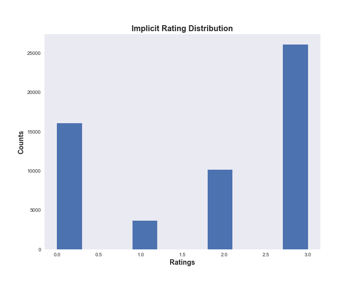
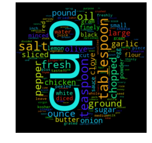
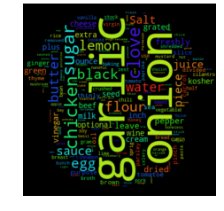

### Recipe Project #2 - Recommender System with Implicit Ratings

#### Business Question/Goal
* Can I build a recipe recommender system from information on the food52.com website.  As a user of the recipes on this website, I wanted to build a recommender that does not rely solely on the recipe's popularity based on the number of likes it garners.

#### Data Understanding
* The dataset used was obtained by scraping the food52 website - focusing primarily on recipes for dishes that were either "pork", "chicken", "beef" or "vegetarian" -based recipes.  Using these search terms, a list of weblinks was generated and used to extract the following - recipe names, #likes, recipe ingredients, comments, from each recipe page.  Since there were no explicit user/rating pairs provided for each recipe, implicit ratings were assigned based on sentiment analysis of user comments.  

#### Data Preparation
* A web scraper [algorithm](https://github.com/pineda-vv/Data-Science-Projects/blob/master/recipe_project/recipe_src/pickle_main_ingredient.py) using BeautifulSoup was optimized with the search items "chicken", "pork", "beef", or "vegetarian". Each search term generated ~200 pages with about 20 unique recipe weblinks per page.  Each list of web links was saved in a pickle file and used by a second [program](https://github.com/pineda-vv/Data-Science-Projects/blob/master/recipe_project/recipe_src/food52_scraper_pickleuser.py) to scrape the data.  The scraped data was saved in a mongo database.

* The contents of the mongodb were extracted using this [snippet](https://github.com/pineda-vv/Data-Science-Projects/blob/master/recipe_project/recipe_src/recipe_eda.py) in a jupyter notebook to generate a csv vile.  Since most of the scraping was done using an AWS EC2 instance, this facilitated transport of the data back to a local machine for analysis.

#### Snapshot of captured Data
**Data Summary**
* There were 9233 recipes where the title, ingredients, aggregated comments, #total likes.  The aggregated comments were unraveled and yielded 17733 commenters/users that provided 52907 comments.

**Deriving Implicit Ratings**
* The food52.com recipe site did not have any explicit ratings data that can be gathered.  Instead, I scraped user comments on the recipes and used NLTK's sentiment analysis module, which determines whether a string of text reflects a positive, negative, or neutral tone.  I used the compound score for each comment which to derive implicit ratings and I used the following arbitrary metric:

**Implicit Rating Schema**
| **Rating** | **Compound Score** | **Sentiment**|
|:---:|:---:|:---:|
| **3** | **> 0.6** | **highly positive**|
| **2** | **0 to 0.6** |**somewhat positive**|
| **1** | **< 0** |**negative**|
| **0** | **no comments** |**n/a**|

* This resulted in the implicit ratings distribution shown here.

**Total count per rating category**
| **Rating** | **Counts** |
|:---:|:---:|
| **3** | **26108** |
| **2** | **10123** |
| **1** | **3665** |
| **0** | **16047** |

**Plot of Ratings Distribution**

---
### Modeling Part 1
**Unsupervised Clustering of recipe ingredients**

**Algorithms Used** - Non-negative Matrix Factorization (NMF) and Latent Dirichlet Allocation (LDA) of Recipe ingredients followed by t-SNE analysis for visualization.
* Unsupervised learning using NMF and LDA was used to analyze the text of recipe ingredients and to cluster similar recipes.  Different number of clustering groups (n_components) to use was   for both model and plotted.  Subjectively, I determined that the ideal number of groups that show the best separation appear to be 6 with NMF and 4 with LDA.  Considering the recipe data was scraped using four search terms, this is not unsurprising.  The meat recipes appear to overlap quite a bit, possibly due to a lot of shared common ingredients(salt).  In fact, as shown in the two wordcloud images, the most common words overall in the recipe text are terms that denote measures of ingredients.  Once these and other common terms are added to the set of stopwords prior to text vectorization, the clustering becomes a little more apparent.

**Word Cloud before and after removing measurement terms**

 

2. Visualization/Evaluation -  truncated SVD(singular value decomposition) combined with t-distributed stochastic neighbor embedding(TSNE) was used for dimensionality reduction of the vectorized recipe text matrices (TF, TFidf).  x, y, and z coordinates (n_components=3) were extracted from the TSNE analysis and each coordinate set was given a label based on either the LDA or NMF analysis and plotted in a 3D scatter plot.  The plots were labeled with summary terms of the top topics from each clustering analysis.  Animating the 3D plots provides a glimpse on how well the clustering worked.  For both LDA and NMF analyses, there was a clear grouping for baked items (top topics - flour, butter, sugar).  The overlap with what I will call "savory" dishes can be explained by the common ingredients shared by all these recipes namely salt, garlic, and onions as well as common spices.

**Non-negative Factorization (NMF) Analysis**

**Latent Dirichlet Allocation (LDA)**

### Modeling Part 2

**Collaborative Filtering**

* Spark MLLib Alternating Least Squares - The recommendation system was built using Spark's ALS model.  The method of collaborative filtering aims to predict the rating of an item by a user based on the behavior of other users that "like" or highly rate the same or similar items. In short, the model takes into account the past actions (likes/ratings/purchases/web page views) of a particular user we'll call userA. The behavior of other users who have rated or liked the same or similar items. Recommendations are based on this second set of "similar" users' inclination for items or products that UserA has not seen or rated.  
A model I will refer to as model2 was also built and cross-validated using just the sentiment compound scores using the implicit rating argument on the ALS model.  After comparing model2's performance with the first model, there was very little difference in both the predictions and the recommendations.

**Evaluation of the recommender model**

 * The user/recipe/implicit ratings matrix was split 80/20 for use as a training and test set.  The true ratings for the test set was removed.  After training the the model, the predictions for the test set were evaluated by calculating the root mean squared error (RMSE).  Item(recipe) and user bias were added to the ALS predicted values.  In cases where the user or item did not appear in the training set (cold start strategy), a 'prediction' was calculated using the overall ratings mean plus the user/item bias terms.
* An average **RMSE of 1.85** was obtained from three validation runs.  The predictions of the test set of the last run are plotted against the true ratings in the following figure. 
As illustrated, the predicted ratings on the test set did not correlate well with the derived "implicit" ratings.  Interestingly, the root mean squared error was relatively large as well when I created a model with the raw compound scores and turning on the implicit ratings options on the ALS algorithm **(RMSE=2.1)**.

3. **Deployment** Although the RMSE provides a measure of the predictive power of the recommendation system (RS), its ultimate measure is how suitable the recommended outputs are to the users.  In the end, the success or failure of the recommendations can only be assessed by testing the recommender in real time.  Deployment of the RS would be integrated into the website, which can provide existing users with a list of recipe recommendations i.e. recipes they have not rated/commented on but is aligned with what similar users have rated.  Whether the user provides comments on any of the recommendation (positive or negative) can be used as a metric on the RS's effectiveness.  For new users, the **cold start** strategy may rely on just presenting recipes with the highest number of likes, a metric that's pervasive in this particular website.  Again, the feedback from the new user about these recipes can then be fed into the RS and additional recommendations can be provided through the results of the collaborative filtering model.

#### Final Thoughts

* Since I am not employed at food52.com, I can only propose an ideal deployment scenario that can be put into practice and then assessed and changed as new data comes in. I feel that this exercise illustrates that deriving implicit ratings from user comments may not be the best path forward in building a robust recommendation system. Although it can be improved upon - for instance by using different methodologies for sentiment analysis like a gensim-based classifier for instance or, by simply getting more comment data - the simple fact is that this analysis is trying to determine user intent from comments that were left for a myriad of reasons. The commenter may have just been asking a question about the recipe or providing information about alternative ingredients for example. This is possibly why some merchants (e.g. Amazon) provides a separate product question/answer forum which is distinct from the customer review.

* If I had access to the datastream at food52.com, one way to get better implicit ratings is to use the visitor's IP address as a user id.  One can then log which recipe pages each user visits and whether or not they give the recipe a star (like) or not.  A simple scoring system might be like the following table.

|Viewed Page | Action | Score|
|:---:|:---|:---:|
|Yes| Did **not** press **Like**. No comment or negative comment| 1|
|Yes| Did **not** press **Like**. Left positive comment| 2|
|Yes|**Pressed Like**.|3|
|Yes|**Pressed Like** + **Positive Comment**|4|

* I may revisit this project again to see if I can improve the recommender. Food52.com **is** my favorite recipe website.
