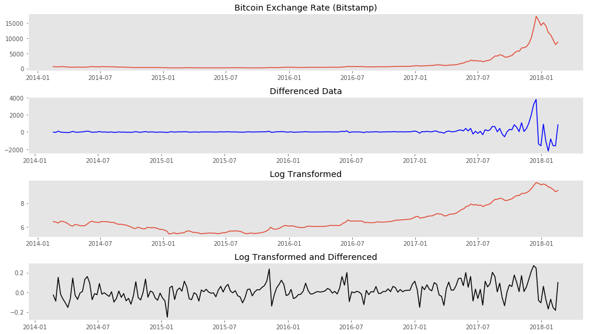
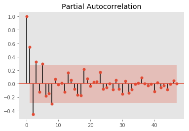
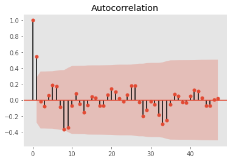
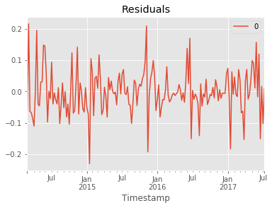
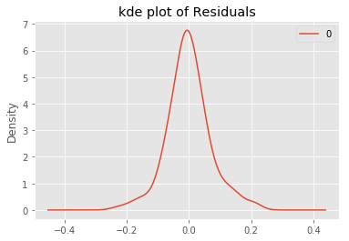
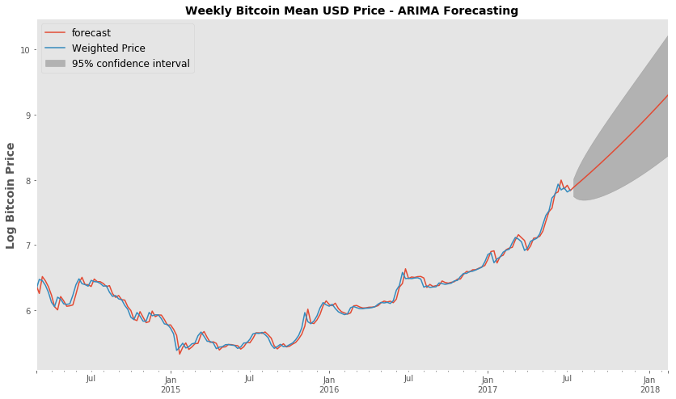
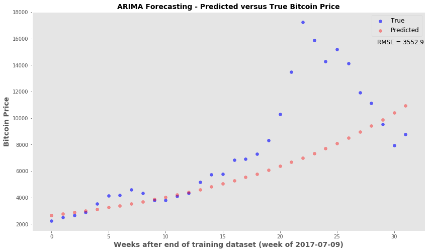
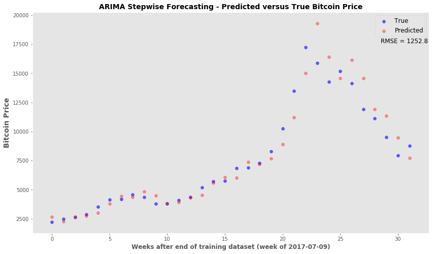

### ARIMA and bitcoin Jupyter Notebook
* Note that this notebook can also be found [here](https://github.com/pineda-vv/bitcoin_timeseries)
```python
import pandas as pd
import numpy as np
import matplotlib.pyplot as plt
import itertools
import numpy as np
import pandas as pd
import matplotlib.pyplot as plt
import statsmodels.api as sm
from statsmodels.tsa.arima_model import ARIMA, ARIMAResults
from statsmodels.tsa.arima_process import ArmaProcess
from statsmodels.stats.diagnostic import acorr_ljungbox
from statsmodels.graphics.tsaplots import plot_acf, plot_pacf
from scipy import signal
import scipy.stats as scs
%matplotlib inline
```


#### The bitcoin dollar price data was downloaded from Quandl.  I chose the set from the Bitstamp Exchange


```python
df2 = pd.read_csv('data/bitstamp.txt', sep='\t')
```


```python
df2.set_index(pd.DatetimeIndex(df2['Timestamp']), inplace=True, drop=True)
```


```python
del df2['Timestamp']
```


```python
df2.head(2)
```


<div>
<style>
    .dataframe thead tr:only-child th {
        text-align: right;
    }

    .dataframe thead th {
        text-align: left;
    }

    .dataframe tbody tr th {
        vertical-align: top;
    }
</style>
<table border="1" class="dataframe">
  <thead>
    <tr style="text-align: right;">
      <th></th>
      <th>Open</th>
      <th>High</th>
      <th>Low</th>
      <th>Close</th>
      <th>Volume (BTC)</th>
      <th>Volume (Currency)</th>
      <th>Weighted Price</th>
    </tr>
    <tr>
      <th>Timestamp</th>
      <th></th>
      <th></th>
      <th></th>
      <th></th>
      <th></th>
      <th></th>
      <th></th>
    </tr>
  </thead>
  <tbody>
    <tr>
      <th>2014-02-16</th>
      <td>655.83</td>
      <td>670</td>
      <td>590.01</td>
      <td>621</td>
      <td>26397.57</td>
      <td>16510289.03</td>
      <td>625.45</td>
    </tr>
    <tr>
      <th>2014-02-17</th>
      <td>621</td>
      <td>664.99</td>
      <td>610</td>
      <td>633.66</td>
      <td>19902.44</td>
      <td>12681178.75</td>
      <td>637.17</td>
    </tr>
  </tbody>
</table>
</div>


```python
# Change to numeric data
df2['Open'] = pd.to_numeric(df2['Open'], errors='coerce')
df2['High'] = pd.to_numeric(df2['High'], errors='coerce')
df2['Low'] = pd.to_numeric(df2['Low'], errors='coerce')
df2['Close'] = pd.to_numeric(df2['Close'], errors='coerce')
df2['Volume (BTC)'] = pd.to_numeric(df2['Volume (BTC)'], errors='coerce')
df2['Volume (Currency)'] = pd.to_numeric(df2['Volume (Currency)'], errors='coerce')
df2['Weighted Price'] = pd.to_numeric(df2['Weighted Price'], errors='coerce')
```


```python
df2.info()
```

    <class 'pandas.core.frame.DataFrame'>
    DatetimeIndex: 1460 entries, 2014-02-16 to 2018-02-14
    Data columns (total 7 columns):
    Open                 1457 non-null float64
    High                 1457 non-null float64
    Low                  1457 non-null float64
    Close                1457 non-null float64
    Volume (BTC)         1457 non-null float64
    Volume (Currency)    1457 non-null float64
    Weighted Price       1457 non-null float64
    dtypes: float64(7)
    memory usage: 91.2 KB


#### Resampled Data for weekly average - used Weighted Price


```python
# Resampled to get weekly mean of 'weighted price'
weekly_bit = df2['Weighted Price'].resample('W').mean()
```


```python
### Plotting weekly price, differenced data, log-transformed data, and differenced log-transformed data
```


```python
plt.style.use('ggplot')
fig, ax = plt.subplots(4, 1, figsize=(14, 8))
ax[0].plot(weekly_bit.index, weekly_bit)
ax[0].set_title('Bitcoin Exchange Rate (Bitstamp)')
ax[0].grid(False)
ax[1].plot(weekly_bit.index, weekly_bit.diff(), color='b')
ax[1].set_title('Differenced Data')
ax[1].grid(False)
ax[2].plot(weekly_bit.index, np.log(weekly_bit))
ax[2].set_title('Log Transformed')
ax[2].grid(False)
ax[3].plot(weekly_bit.index, np.log(weekly_bit).diff(), color='k')
ax[3].set_title('Log Transformed and Differenced')
ax[3].grid(False)
# ax.set_title('Philippine Peso Weekly Exchange Rate')
plt.tight_layout()
# plt.savefig('data/bitcoin_transformation.png')
```


{:class="img-responsive"}


#### Log transformation and differencing appear to have made the time series stationary.
#### ADFuller test for stationarity confirms this.


```python
untransformed = sm.tsa.stattools.adfuller(weekly_bit)
diffed_week = sm.tsa.stattools.adfuller(weekly_bit.diff()[1:])
logged_week = sm.tsa.stattools.adfuller(np.log(weekly_bit))
log_diff_week = sm.tsa.stattools.adfuller(np.log(weekly_bit).diff()[1:])
log_diff2 = sm.tsa.stattools.adfuller(np.log(weekly_bit).diff(2)[2:])
```


```python
print 'ADFuller Test for Stationarity'
print 'Untransformed Series {}'.format(untransformed[1])
print 'Differenced (1) {}'.format(diffed_week[1])
print 'Log Transformation {}'.format(logged_week[1])
print 'Log Transformation and Differencing(1) {}'.format(log_diff_week[1])
print 'Log Transformation and Differencing(2) {}'.format(log_diff2[1])
```

    ADFuller Test for Stationarity
    Untransformed Series 1.0
    Differenced (1) 0.741516170524
    Log Transformation 0.994334841317
    Log Transformation and Differencing(1) 3.01872830745e-18
    Log Transformation and Differencing(2) 2.07801212847e-05


```python
# the differenced log-transformed data had the lowest ADFuller score
log_weekly_bit = np.log(weekly_bit)
```


```python
plot_pacf(log_weekly_bit.diff(2)[2:50])
plt.grid(False)
# plt.savefig('data/bitcoin_pacf.png')
```





```python
plot_acf(log_weekly_bit.diff(2)[2:50])
plt.grid(False)
plt.savefig('data/bitcoin_acf.png')
```





#### Autocorrelation and partial autocorrelation plots suggests an optimal AR(2) and MA(1) is sufficient with differencing of 1

#### Also performed a training and testing set split of the data. Trained on the first 85% and will validate on the remaining 15% of the series.

#### However,  optimization runs showed that when the (p,d,q) values of (1,2,1) was used we obtained the lowest AIC, BIC scores and best p-values for coeffs


```python

idx3 = int(len(log_weekly_bit) * 0.85)
train3 = log_weekly_bit[:idx3]
test3 = log_weekly_bit[idx3:]
model3 = ARIMA(train3, order=(1,2,1))
model_fit3 = model3.fit(disp=0)
print(model_fit3.summary())
# plot residual errors
residuals3 = pd.DataFrame(model_fit3.resid)
residuals3.plot()
plt.title('Residuals')
plt.show()
residuals3.plot(kind='kde')
plt.title('kde plot of Residuals')
# pyplot.show()
print(residuals3.describe())
```

                                 ARIMA Model Results                              
    ==============================================================================
    Dep. Variable:      D2.Weighted Price   No. Observations:                  176
    Model:                 ARIMA(1, 2, 1)   Log Likelihood                 218.904
    Method:                       css-mle   S.D. of innovations              0.069
    Date:                Thu, 01 Mar 2018   AIC                           -429.807
    Time:                        23:56:20   BIC                           -417.125
    Sample:                    03-02-2014   HQIC                          -424.664
                             - 07-09-2017                                         
    ===========================================================================================
                                  coef    std err          z      P>|z|      [0.025      0.975]
    -------------------------------------------------------------------------------------------
    const                       0.0004      0.000      2.930      0.004       0.000       0.001
    ar.L1.D2.Weighted Price     0.1818      0.074      2.447      0.015       0.036       0.327
    ma.L1.D2.Weighted Price    -1.0000      0.015    -65.765      0.000      -1.030      -0.970
                                        Roots                                    
    =============================================================================
                     Real           Imaginary           Modulus         Frequency
    -----------------------------------------------------------------------------
    AR.1            5.5018           +0.0000j            5.5018            0.0000
    MA.1            1.0000           +0.0000j            1.0000            0.0000
    -----------------------------------------------------------------------------





                    0
    count  176.000000
    mean    -0.000787
    std      0.070537
    min     -0.230235
    25%     -0.040174
    50%     -0.004960
    75%      0.035439
    max      0.216069





```python
from sklearn.metrics import mean_squared_error
```


```python
""" Setting arrays for true values in the test set and predicted/forecast values from the model """
truth = test3.head(32).values
forecast = (model_fit3.forecast(steps=32))
pred = forecast[0]
```


```python
rmse = np.sqrt(mean_squared_error(truth, pred))
print 'Root MSE {}'.format(rmse)
```

    Root MSE 0.353034310708


```python
fig, ax = plt.subplots(figsize=(14,8))
fig = model_fit3.plot_predict(start='2014-03-02', end='2018-02-18', ax=ax)
legend = ax.legend(loc='upper left', fontsize='large')
ax.set_ylabel('Log Bitcoin Price',fontsize=14, fontweight='bold')
ax.set_title('Weekly Bitcoin Mean USD Price - ARIMA Forecasting', fontsize=14, fontweight='bold' )
ax.grid(False)
# plt.savefig('data/confidence.png')
```





#### Using the ARIMA forecast function - Looking at how the forecast price (untransformed) compares to the truth


```python
plt.style.use('ggplot')
fig, ax = plt.subplots(figsize=(14,8))
x_val = range(len(truth))
ax.scatter(x_val, np.exp(truth), c='blue', label='True', alpha=0.6)
ax.scatter(x_val, np.exp(pred), c='red', alpha=0.4, label='Predicted')
ax.set_xlabel('Weeks after end of training dataset (week of 2017-07-09)', fontsize=14, fontweight='bold')
ax.set_ylabel('Bitcoin Price', fontsize=14, fontweight='bold')
ax.legend(fontsize='large', markerscale=1)
ax.grid(False)
ax.set_title('ARIMA Forecasting - Predicted versus True Bitcoin Price', fontsize=14, fontweight='bold' )
ax.text(28.5, 15600, 'RMSE = 3552.9', fontsize=12)
# plt.savefig('data/forecasting.png')
```


    <matplotlib.text.Text at 0x112e2e810>





#### Stepwise Forecasting/Retraining ARIMA model
* The idea is that most accurate predictions occur in the first few time points past the training set
* This snippet will forecast only to the next time point
* Afterwards, the true price for that time point is added back to the series and the ARIMA model is retrained.
* The retrained model will then forecast the following time point and the retraining is performed again after every forecasting step.


```python
from collections import deque
moving = list(train3)
mov_test = deque(test3)
pred_steps =[]
for n in range(len(test3)):
    model = ARIMA(moving, order=(1,2,1))
    model_fit = model.fit(disp=0)
    forecast_one = model_fit.forecast(steps=1) # forecast the next time point only
    pred_steps.append(forecast_one[0])
    z = mov_test.popleft()
    moving.append(z) #update the training data with next time point
```


```python
#rmse of stepwise
np.sqrt(mean_squared_error(np.exp(test3), np.exp(pred_steps)))
```


    1252.7893334584987


```python
plt.style.use('ggplot')
fig, ax = plt.subplots(figsize=(14,8))
x_val = range(len(test3))
ax.scatter(x_val, np.exp(test3), c='blue', label='True', alpha=0.6)
ax.scatter(x_val, np.exp(pred_steps), c='red', alpha=0.4, label='Predicted')
ax.set_xlabel('Weeks after end of training dataset (week of 2017-07-09)', fontsize=12, fontweight='bold')
ax.set_ylabel('Bitcoin Price', fontsize=14, fontweight='bold')
ax.legend(fontsize='large', markerscale=1)
ax.grid(False)
ax.set_title('ARIMA Stepwise Forecasting - Predicted versus True Bitcoin Price', fontsize=14, fontweight='bold' )
ax.text(28.5, 17600, 'RMSE = 1252.8', fontsize=12)
# plt.savefig('data/forecasting_stepwise.png')
```


    <matplotlib.text.Text at 0x111b67b10>





#### Conclusion - ARIMA time series modeling can provide a decent forecasting tool. If the forecasting algorithm is set up so that the model can be continually updated, then the forecasts for the immediate time points are acceptable.  I will revisit this time series model with unseen new data. This particular time series ended in mid-February 2018 and I will wait a few weeks to do the two forecasting analysis again.


```python

```
