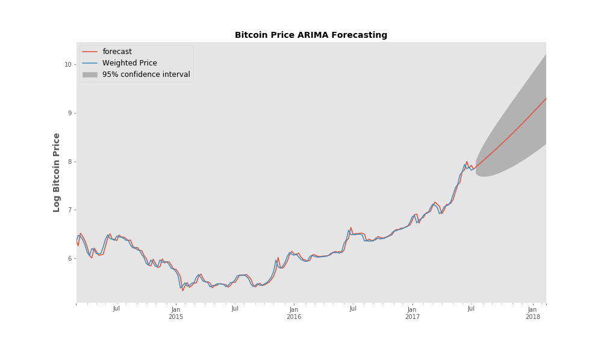
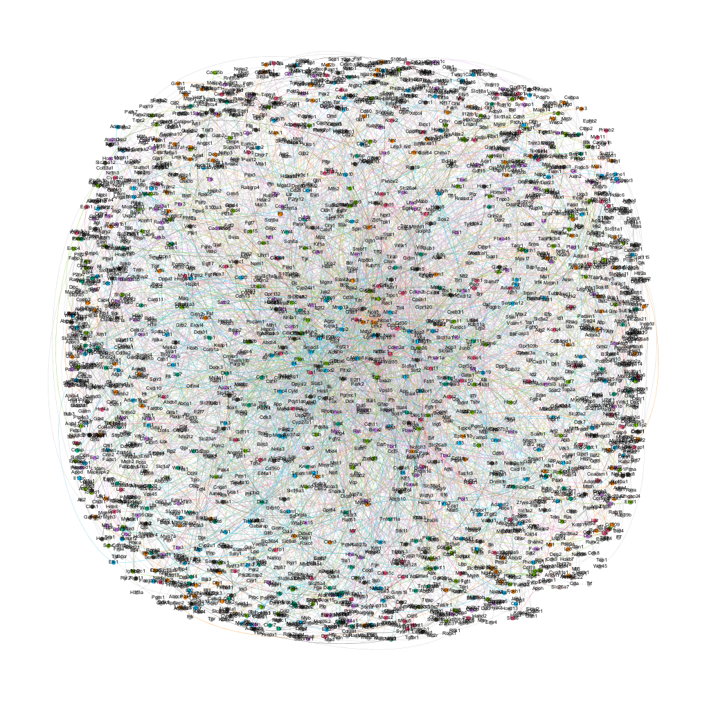

<!-- Global site tag (gtag.js) - Google Analytics -->

## Data Science Projects

### **All projects:**
* Python was used for all projects unless otherwise noted.
* Primary machine learning algorithms and tools used were from the sci-kit learn library unless otherwise noted.
* For the individual projects, I sourced and subsequently cleaned all the data that were used in the analysis.
* All projects followed the CRISP-DM methodology.
* Cross-validation was generally used to evaluate any model. This was usually done splitting the data 70/30 randomly or in case of the time series analysis, holding out the most recent time points of the data series.

### **Individual Projects**
#### **A short time series analysis of currency exchange**
* **Tools used** - Python, Matplotlib, Statsmodels
* **Primary algorithm** - Autoregressive Integrated Moving Average (ARIMA) model.
* **Summary** - I took two completely unrelated currency dataset - the Philippine Peso/USD exchange
rate and the Bitcoin Price - and analyzed their fluctuations over time. I built an ARIMA model for each data set and validated each model's forecasting performance. Details can be found [here](https://github.com/pineda-vv/bitcoin_timeseries)
{:class="img-responsive"}

#### **Recipe recommender - Implicit and Explicit Ratings**
* **Tools used** - Python, Beautiful Soup, Selenium, MongoDB, AWS EC2, PySpark, t-SNE, Latent Dirichlet Allocation, Non-negative Matrix Factorization, Alternating Least Squares (ALS), NLTK
* **Primary algorithm** - Collaborative Filtering using Spark's Alternating Least Squares (ALS)
* **Summary** - Using data I scraped from two popular recipe websites, I used Spark's Collaborative Filtering algorithm (ALS) to build two recipe recommender systems. With data from the first website, I used the explicit ratings that users left for each unique recipe to build the model. From the second site, I derived implicit ratings using text sentiment analysis from user comments. I elaborate upon these differences in these two blog posts - [explicit](http://pineda-v.com/2018-02-14-post_galvanize_project-1/) or [implicit ratings](http://pineda-v.com/2018-02-24-recipe-2/). Technical details can be found [here](https://github.com/pineda-vv/allrnecipe_recommender) and [here](https://github.com/pineda-vv/Data-Science-Projects/tree/master/recipe_project).
{:class="img-responsive"}

#### **Creating Gene Networks using NLP**
* **Tools used** - Python, NLTK, Non-negative Matrix Factorization (NMF), Latent Dirichlet Allocation (LDA), Networkx, Postgres, AWS EC2.
* **Summary** - My goal for this project was to create a gene association network that required no prior knowledge of biology. I used only the abstracts of scientific papers to create the gene-pairing and then used NMF-clustering of the abstracts' text to identify cluster similar articles. I built a Postgres SQL database with this information and created a piece of code that can use a single gene input to return a graph of genes associated with the input as well as a list of related papers.  More information can be found [here](https://github.com/pineda-vv/Creating-gene-networks-using-NLP)
{:class="img-responsive"}

### **Group/Class Case Studies**
#### **Fraud detection system**
* **Tools used** - Python, Flask
* **Primary algorithm** - Random Forest Classifier
* **Summary** - Our team built a classifier model to detect fraudulent postings for an e-commerce event showcase company. We chose an RFC model, used grid-search to optimize and cross-validation to evaluate the model's performance. We then chose appropriate probability thresholds for use in flagging possible fraud. The model was deployed using a dashboard and a simulated real-time data stream was subsequently screened. The fraud/not fraud probability score for the new postings was used to determine if any actionable response is required - to have a human follow up with the posting or, to immediately shut down the posting.

#### **Movie Recommender**
* **Tools used** - Python, PySpark, Spark MLLib
* **Primary algorithm** - Spark Alternating Least Squares (ALS) for collaborative filtering
* **Summary** - Using the MovieLens dataset, our team built a recommender using collaborative filtering. We implemented a basic mathematical algorithm to take user and item bias into account. This was also used as solution for users or items  that were not present in the training set. We also presented a few solutions to the cold-start problem of recommending an item to a new user.

#### **Churn prediction for a ride-share company**
* **Tools used** - Python, pandas, numpy, sci-kit learn.
* **Primary algorithm** Gradient Boosted Classifier.
* **Summary** - We took ride-share data to predict churn. Most of the initial exploratory data analysis (EDA) included data clean-up, some feature engineering, and creating churn/not churn labels for the dataset. We tested different models but in the end, our group went with a gradient boosting classifier algorithm which we optimized using grid-search CV, and evaluated using hold-out cross-validation. We used the model's precision and recall on the test data as our performance indicators and to set the threshold to use depending on what the model's intended use.

#### **Linear Regression Case Study**
* **Tools used** - Python, pandas, numpy, sci-kit learn.
* **Primary algorithm** - Linear Regression
* **Summary** - Predicting future sales at a farm equipment auction house. Using data from previous auctions, we used linear regression algorithms to build a model that predicts future auction prices. First exposure to data transformation to optimize the performance of a regression model.
